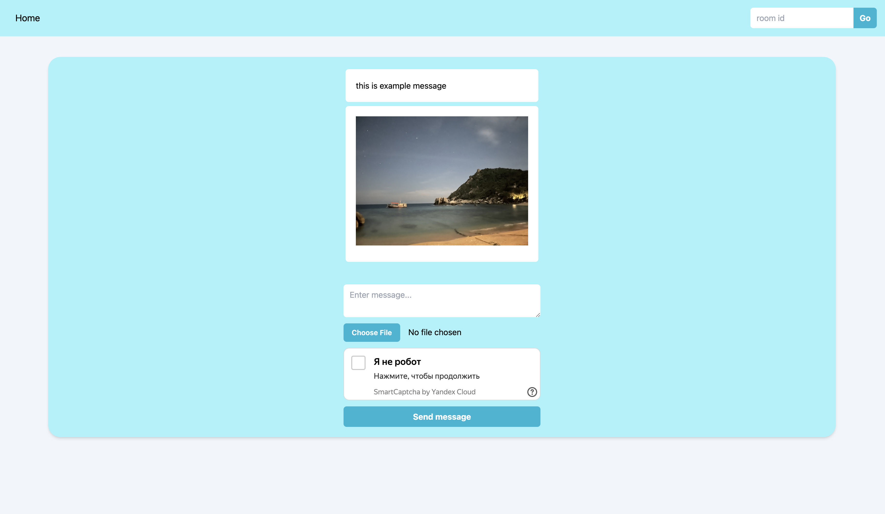

# Chatrooms

Dead simple chat application with multiple rooms and tampermonkey client, embeddable into any page.

## Features

- Automatic HTTPS via Caddy
- Yandex SmartCaptcha prevents bad actors from filling your installation with garbage
- Supports image content in messages
- Highly customizable client, which can be embedded into any page on the internet

## Demo

    

## How to set up?

1. Create and configure captcha in Yandex Cloud console (you can use [this guide](https://yandex.cloud/en/docs/smartcaptcha/quickstart#creat-captcha) to do so);
2. Obtain a domain name and configure it to point to your server;
3. Rename [`.envrc.example`](./.envrc.example) to `.envrc` and set variables to corresponding values;
4. Run `docker compose up -d` to launch your application;
5. Install [Tampermonkey extension](https://www.tampermonkey.net) to your browser and add [client script](./tampermonkey/script.js) to it;
    - Edit `chatRoomsBackend` variable value to set backend address to your installation;
    - You can modify `// @match` comment of tampermonkey script to configure on which sites the client is active.

Ta-daa! You're ready to go!

## Contributing

Feel free to open issues and submit pull requests if you believe you have something to add to the project or want to discuss any ideas!
